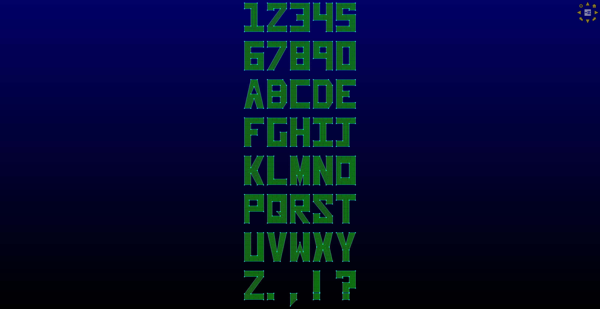

# pwAlphaNumeric Glyph script

This script may be used in Pointwise to create 'blocky' capital letters,
numbers, and some punctuation.

This is just for fun and was created to demo the Glyph script functionality in
Pointwise.

